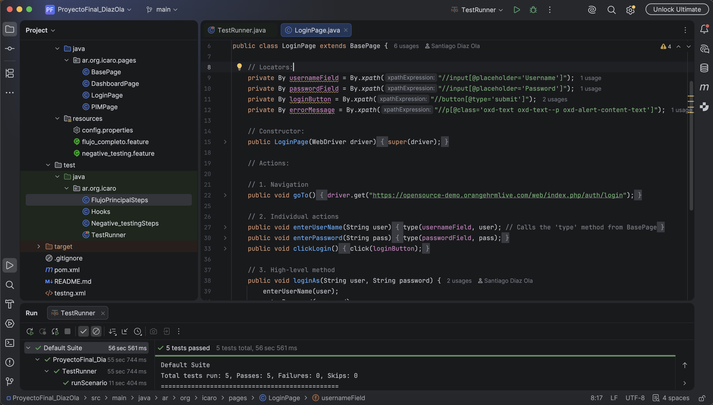

#  **OrangeHRM BDD Automation Framework**

**Project Goal:** To build an enterprise-grade, behavior-driven test automation framework validating authentication, user administration, and security workflows on the OrangeHRM platform.



---

## 📊 **Executive Summary**
This repository houses a comprehensive end-to-end test automation suite built using **Java, Selenium WebDriver, Cucumber (BDD), and TestNG**. The framework implements the **Page Object Model (POM)** design pattern to ensure clean separation of concerns, high code reusability, and long-term maintainability.

### **Key Execution Metrics**
* **Total Scenarios:** 5 automated end-to-end user flows.
* **Pass Rate:** 100% execution success across positive and negative test suites.
* **Design Pattern:** Page Object Model (POM) with centralized configuration management.

---

## 🏗️ **Architectural Framework & Design Patterns**

* **Behavior-Driven Development (BDD):** Business-facing Gherkin syntax (`.feature` files) bridges the gap between technical automation and functional business requirements.
* **Page Object Model (POM):** UI locators and user actions are encapsulated inside dedicated page classes (`LoginPage`, `DashboardPage`, `PIMPage`) inheriting from a core `BasePage`.
* **Centralized Configuration:** Environment variables, application URLs, and global parameters are cleanly managed via `config.properties`.
* **Robust Synchronization:** Implements explicit waits within the framework to handle dynamic web elements reliably.

---

## 🛠️ **Tech Stack**
* **Language:** Java
* **Automation Engine:** Selenium WebDriver
* **BDD Parser:** Cucumber (Gherkin)
* **Test Runner & Assertions:** TestNG
* **Build Tool & Dependency Management:** Maven
* **IDE:** IntelliJ IDEA
* **Design Pattern:** Page Object Model (POM)

---

## **Project Structure**
```text
ProyectoFinal_DiazOla/
├── src/
│   ├── main/java/ar/org/icaro/
│   │   ├── pages/           # Page Object classes (BasePage, LoginPage, etc.)
│   │   └── ...
│   └── test/
│       ├── java/ar/org/icaro/ # Step definitions, hooks, and TestRunner classes
│       └── resources/       # Feature files (.feature) and config.properties
├── evidence/                # Execution screenshots and visual documentation
├── pom.xml                  # Maven dependencies and build profiles
└── testng.xml               # TestNG suite runner configuration

