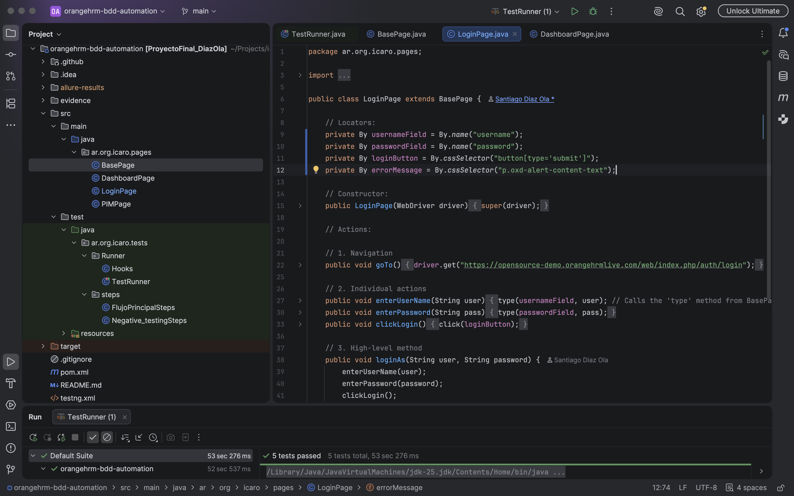
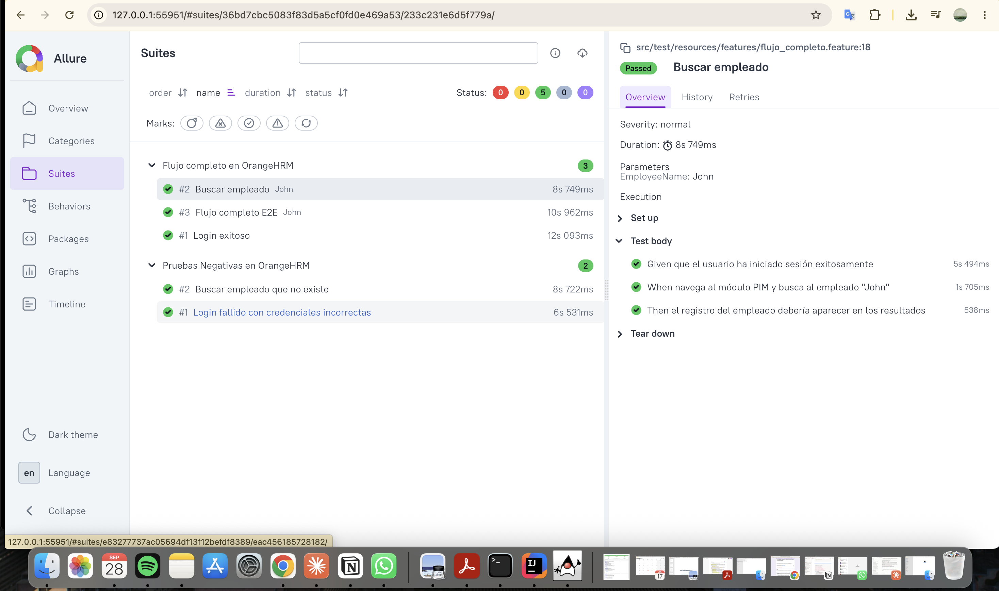
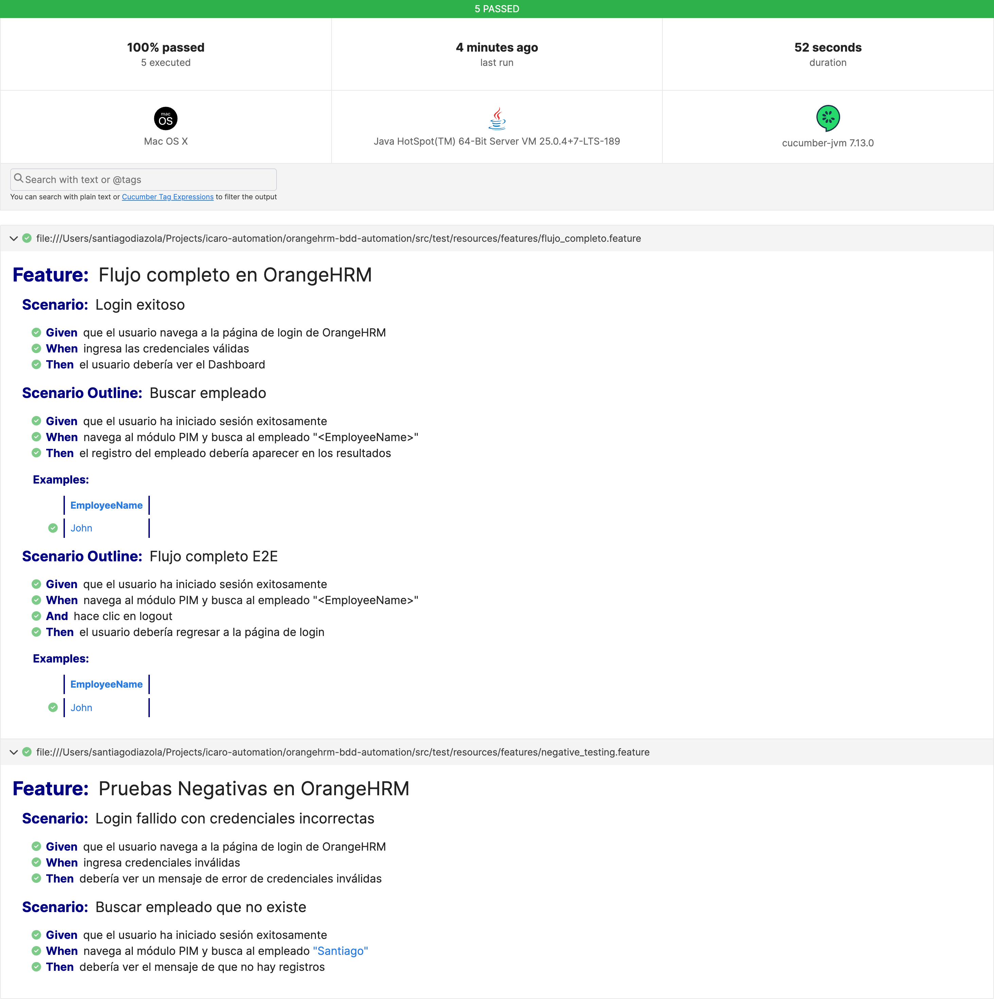

# OrangeHRM BDD Automation Framework


An end-to-end UI test automation framework for validating authentication, user administration, and negative/security-related workflows in OrangeHRM. It combines **Java, Selenium WebDriver, Cucumber BDD, TestNG, Maven, and the Page Object Model (POM)**, with automated execution through **GitHub Actions**.



---

## Project Goal

The objective of this project is to demonstrate a maintainable UI automation framework capable of validating critical user workflows while keeping test logic, page interactions, configuration, and execution responsibilities clearly separated.

The framework focuses on:

- Authentication workflows
- User administration
- Negative and security-related scenarios
- Maintainable test architecture
- Automated CI execution
- Execution reporting and evidence

---

## Executive Summary

The framework implements **Behavior-Driven Development (BDD)** using Cucumber and Gherkin, with Selenium WebDriver responsible for browser automation and TestNG for test execution and assertions.

The **Page Object Model (POM)** separates UI interactions from business-level test behavior, while centralized configuration and explicit waits improve maintainability and synchronization.

### Key Execution Metrics

| Metric | Result |
|---|---:|
| Automated scenarios | 5 |
| Authentication scenarios | 2 |
| User administration scenarios | 2 |
| Negative / security scenarios | 1 |
| Execution pass rate | 100% |
| Design pattern | Page Object Model |

> The metrics above represent the current automated test suite and execution evidence included in this repository.

---

## Automated Coverage

| Area | Scenarios |
|---|---:|
| Authentication | 2 |
| User Administration | 2 |
| Negative / Security | 1 |
| **Total** | **5** |

The current suite covers both positive and negative user flows, providing a foundation that can be extended as additional requirements and application areas are automated.

---

## Engineering Decisions

### Page Object Model

Page-specific locators and interactions are encapsulated in dedicated page classes.

This keeps step definitions focused on **business behavior** rather than implementation details and reduces duplication when UI elements or workflows change.

```text
Feature
   ↓
Step Definition
   ↓
Page Object
   ↓
Selenium WebDriver
   ↓
OrangeHRM
```
## Tech Stack

| Technology | Purpose |
|---|---|
| **Java** | Programming language |
| **Selenium WebDriver** | Browser automation |
| **Cucumber / Gherkin** | BDD and executable specifications |
| **TestNG** | Test execution and assertions |
| **Maven** | Build and dependency management |
| **GitHub Actions** | Continuous integration |
| **IntelliJ IDEA** | Development environment |
| **Page Object Model** | UI automation architecture |

---

## CI/CD

The automated test suite can be executed through **GitHub Actions**, providing repeatable validation through a CI workflow.

### Pipeline

```text
GitHub Actions
      ↓
    Maven
      ↓
TestNG / Cucumber
      ↓
Test Execution
      ↓
Reports & Evidence
```
## Project Structure

```text
orangehrm-bdd-automation/
├── .github/
│   └── workflows/
│       └── maven.yml              # CI workflow
│
├── src/
│   ├── main/
│   │   └── java/ar/org/icaro/
│   │       └── pages/             # Page Object classes
│   │
│   └── test/
│       ├── java/ar/org/icaro/
│       │   ├── stepdefinitions/  # Cucumber step definitions
│       │   ├── hooks/            # Test hooks
│       │   └── TestRunner/       # Test execution
│       │
│       └── resources/
│           ├── features/          # Gherkin feature files
│           └── config.properties  # Configuration
│
├── evidence/                      # Execution screenshots & reports
├── pom.xml                        # Maven configuration
└── testng.xml                     # TestNG suite configuration
```

## Test Execution

The framework can be executed locally using Maven.
```text
mvn clean test
```
## Reports & Evidence

### **1. Allure Interactive Dashboard**
Visualize advanced metrics charts, test durations, and step breakdowns:
Test cases executed successfully with a 100% pass rate.*


### **Cucumber Test Execution**
*Detailed report of validated BDD features and steps.*


## Test Design Approach

The automation suite combines positive and negative scenarios to validate expected behavior as well as selected invalid or unexpected inputs.

The current implementation demonstrates:

* Reusable Page Objects
* Business-oriented Gherkin scenarios
* Explicit synchronization
* Centralized configuration
* Positive and negative test coverage
* Automated execution through Maven
* CI execution through GitHub Actions
* Test reporting and execution evidence
* Future Improvements

Potential extensions to the framework include:

* Expanding functional coverage across additional OrangeHRM modules
* Increasing negative and boundary-value coverage
* Adding API-level validation where applicable
* Introducing test data management
* Parallel test execution
* Browser parameterization
* Expanded CI reporting and artifact retention
* Integration with additional test management tools

## Author

Santiago Diaz Ola

QA Engineer transitioning from a background in Psychology, with a focus on software quality, test automation, API testing, and risk-based testing.
